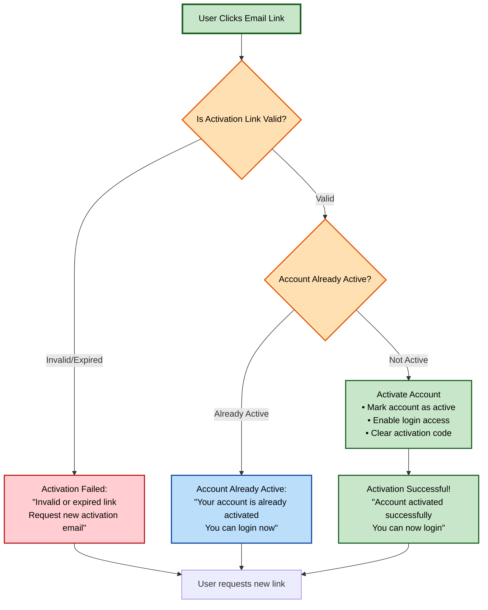
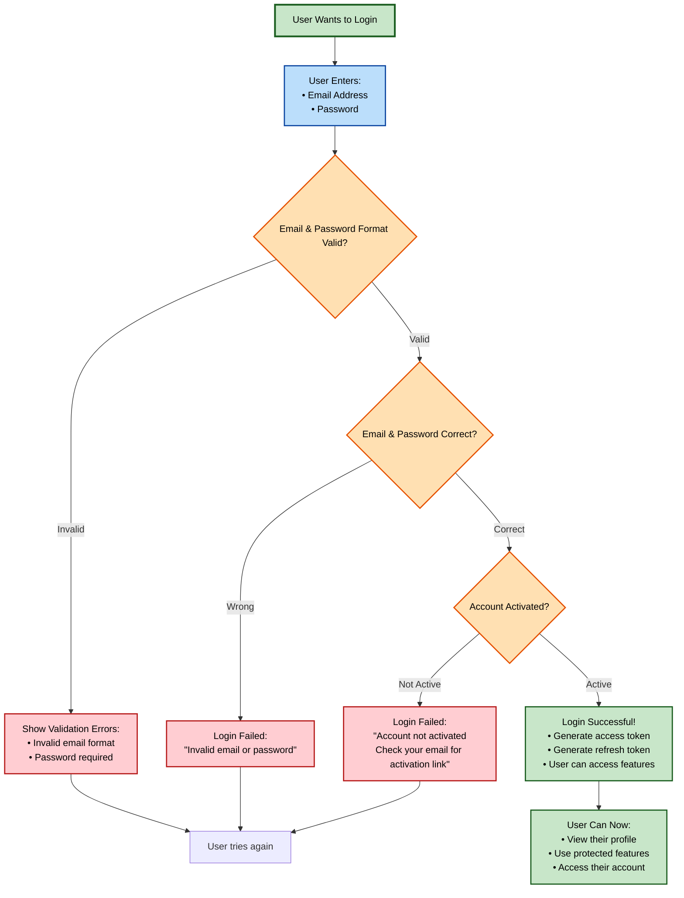

## Account Activation Process

```mermaid
flowchart TD
    StartActivation[User Clicks Email Link] --> CheckToken{Is Activation Link Valid?}

    CheckToken -->|Invalid/Expired| InvalidToken[Activation Failed:<br/>&quot;Invalid or expired link<br/>Request new activation email&quot;]

    CheckToken -->|Valid| CheckStatus{Account Already Active?}

    CheckStatus -->|Already Active| AlreadyActive[Account Already Active:<br/>&quot;Your account is already activated<br/>You can login now&quot;]

    CheckStatus -->|Not Active| ActivateAccount[Activate Account<br/>• Mark account as active<br/>• Enable login access<br/>• Clear activation code]

    ActivateAccount --> ActivationSuccess[Activation Successful!<br/>&quot;Account activated successfully<br/>You can now login&quot;]

    InvalidToken --> EndActivation[User requests new link]
    AlreadyActive --> EndActivation
    ActivationSuccess --> EndActivation

    %% Styling
    classDef startClass fill:#c8e6c9,stroke:#1b5e20,stroke-width:3px,color:#000000
    classDef errorClass fill:#ffcdd2,stroke:#b71c1c,stroke-width:2px,color:#000000
    classDef successClass fill:#c8e6c9,stroke:#1b5e20,stroke-width:2px,color:#000000
    classDef infoClass fill:#bbdefb,stroke:#0d47a1,stroke-width:2px,color:#000000
    classDef decisionClass fill:#ffe0b2,stroke:#e65100,stroke-width:2px,color:#000000

    class StartActivation startClass
    class InvalidToken errorClass
    class ActivateAccount,ActivationSuccess successClass
    class AlreadyActive infoClass
    class CheckToken,CheckStatus decisionClass
```

## User Login Process

```mermaid
flowchart TD
    StartLogin[User Wants to Login] --> InputLogin[User Enters:<br/>• Email Address<br/>• Password]

    InputLogin --> ValidateLogin{Email & Password Format Valid?}

    ValidateLogin -->|Invalid| ValidationFailLogin[Show Validation Errors:<br/>• Invalid email format<br/>• Password required]

    ValidateLogin -->|Valid| CheckCredentials{Email & Password Correct?}

    CheckCredentials -->|Wrong| InvalidCredentials[Login Failed:<br/>&quot;Invalid email or password&quot;]

    CheckCredentials -->|Correct| CheckActive{Account Activated?}

    CheckActive -->|Not Active| NotActivated[Login Failed:<br/>&quot;Account not activated<br/>Check your email for activation link&quot;]

    CheckActive -->|Active| LoginSuccess[Login Successful!<br/>• Generate access token<br/>• Generate refresh token<br/>• User can access features]

    ValidationFailLogin --> EndLogin[User tries again]
    InvalidCredentials --> EndLogin
    NotActivated --> EndLogin
    LoginSuccess --> UserAccess[User Can Now:<br/>• View their profile<br/>• Use protected features<br/>• Access their account]

    %% Styling
    classDef startClass fill:#c8e6c9,stroke:#1b5e20,stroke-width:3px,color:#000000
    classDef errorClass fill:#ffcdd2,stroke:#b71c1c,stroke-width:2px,color:#000000
    classDef successClass fill:#c8e6c9,stroke:#1b5e20,stroke-width:2px,color:#000000
    classDef processClass fill:#bbdefb,stroke:#0d47a1,stroke-width:2px,color:#000000
    classDef decisionClass fill:#ffe0b2,stroke:#e65100,stroke-width:2px,color:#000000

    class StartLogin startClass
    class ValidationFailLogin,InvalidCredentials,NotActivated errorClass
    class LoginSuccess,UserAccess successClass
    class InputLogin processClass
    class ValidateLogin,CheckCredentials,CheckActive decisionClass
```
