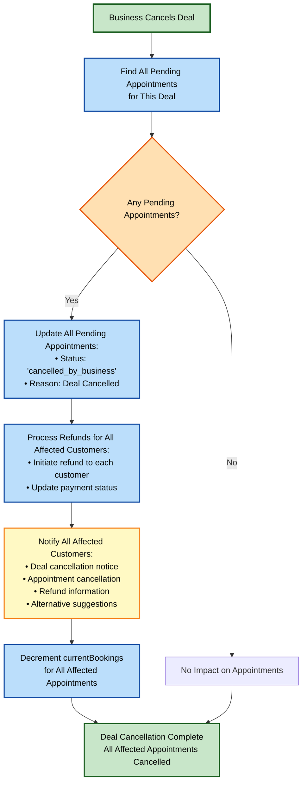

# Appointment Workflow Flows

## Appointment Status System

Appointments have the following possible statuses:
- **`pending`**: Appointment has been created by customer, awaiting business confirmation
- **`confirmed`**: Business has confirmed the appointment
- **`rejected`**: Business has rejected the appointment
- **`cancelled_by_customer`**: Customer cancelled the appointment
- **`cancelled_by_business`**: Business cancelled the appointment
- **`rescheduled_pending`**: Appointment is being rescheduled, awaiting confirmation
- **`completed`**: Appointment has been completed successfully
- **`no_show`**: Customer did not show up for the appointment
- **`expired`**: Appointment expired (past appointment time without completion)

## 1. Customer Booking Flow

This flow covers the initial appointment booking process from customer's perspective.

## 2. Business Confirmation Flow

This flow covers how business handles new appointment requests.

## 3. Customer Cancellation Flow

This flow covers customer-initiated cancellations.

## 4. Business Cancellation Flow

This flow covers business-initiated cancellations.

## 5. Deal Cancellation Impact Flow

This flow covers what happens when a business cancels a deal that has pending appointments.

## 6. Reschedule Flow

This flow covers both customer-initiated and business-initiated rescheduling.

## 7. Appointment Execution Flow

This flow covers what happens when the appointment date/time arrives.

## 8. Appointment Expiration Flow

This flow covers what happens when an appointment expires without completion or cancellation.

## Appointment Status Transitions

## Customer Actions Matrix

| Appointment Status | Customer Can | Customer Cannot |
|-------------------|--------------|-----------------|
| `pending` | Cancel, Request Reschedule, Request Changes | Confirm, Mark Complete |
| `confirmed` | Cancel, Request Reschedule, Request Changes | Reject, Mark Complete |
| `rescheduled_pending` | Accept Reschedule, Reject Reschedule, Cancel | Confirm, Reject |
| `completed` | Provide Feedback, Book Again | Cancel, Reschedule |
| `rejected` | Book Alternative Appointment | Cancel, Confirm |
| `cancelled_by_customer` | Book New Appointment | Any Actions on This Appointment |
| `cancelled_by_business` | Request Refund, Book Alternative | Confirm, Cancel |
| `no_show` | Book New Appointment, Pay No-Show Fee | Reschedule This Appointment |
| `expired` | Book New Appointment | Any Actions on This Appointment |

## Business Actions Matrix

| Appointment Status | Business Can | Business Cannot |
|-------------------|--------------|-----------------|
| `pending` | Confirm, Reject, Request Changes, Cancel | Mark Complete |
| `confirmed` | Cancel, Reschedule, Mark Complete | Reject |
| `rescheduled_pending` | Confirm Reschedule, Reject Reschedule | Mark Complete |
| `completed` | View Feedback, Contact Customer | Cancel, Reschedule |
| `rejected` | Contact Customer | Confirm, Cancel |
| `cancelled_by_customer` | View Details, Contact Customer | Confirm, Cancel |
| `cancelled_by_business` | View Details, Contact Customer | Confirm, Cancel |
| `no_show` | Charge No-Show Fee, Contact Customer | Reschedule, Cancel |
| `expired` | View Details, Archive | Any Actions |

## Email Notification Flow

## Key Paths to Verify

### ✅ Covered Paths:

1. **Booking Flow**
   - Customer selects deal → Selects time → Enters details → Payment → Appointment created → Email sent → Business notified

2. **Business Confirmation Flow**
   - Business receives notification → Reviews → Confirms/Rejects → Email sent to customer

3. **Cancellation Flows**
   - Customer cancels (with refund policy check)
   - Business cancels (with refund processing)
   - Deal cancellation (affects all pending appointments)

4. **Reschedule Flows**
   - Customer requests reschedule → Business confirms/rejects
   - Business requests changes → Customer accepts/rejects

5. **Appointment Execution**
   - Customer shows up → Appointment completed → Feedback requested
   - Customer no-show → Marked as no-show → Notifications sent

6. **Edge Cases**
   - Payment failure
   - Deal unavailable/sold out
   - Appointment expiration
   - Invalid time slots

### ⚠️ Potential Missing Paths to Consider:

1. **Partial Payments/Deposits**: What if business requires deposit only?
2. **Waitlist System**: What if deal is full - should there be a waitlist?
3. **Auto-Confirm**: Should some appointments auto-confirm without business action?
4. **Recurring Appointments**: What if customer wants to book multiple sessions?
5. **Group Bookings**: Can multiple customers book same time slot?
6. **Reminder System**: Should there be automated reminders (24h before, 1h before)?
7. **Late Arrival**: What if customer arrives late but within grace period?
8. **Emergency Cancellation**: Special handling for emergency cancellations?
9. **Dispute Resolution**: What if customer disputes appointment quality/service?
10. **Refund Disputes**: What if refund fails or is contested?
11. **Business Holiday Closures**: How are appointments handled during business closure?
12. **Service Unavailability**: What if service becomes unavailable after booking?
13. **Customer Account Deletion**: What happens to appointments if customer deletes account?
14. **Business Account Disabled**: What happens to appointments if business is disabled?
15. **Time Zone Handling**: What if customer books across time zones?
16. **Recurring Deal Bookings**: Can same customer book multiple instances of recurring deal?

