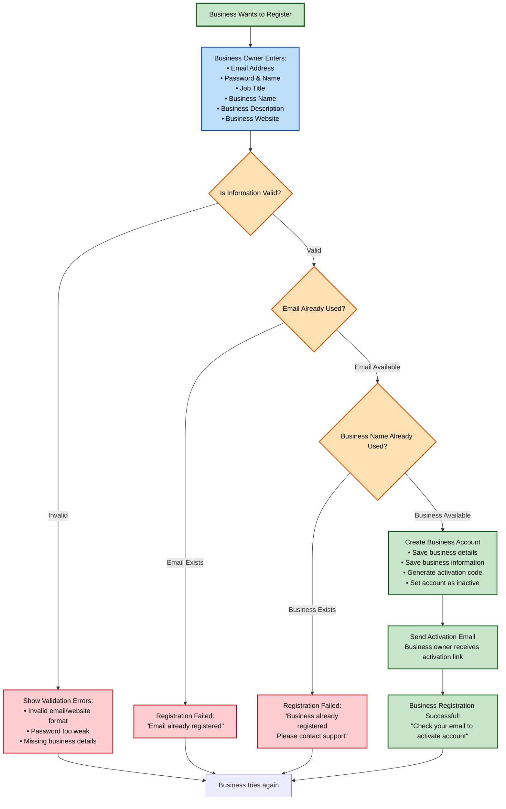

# Zendulge API - Business Process Flows

## Business Registration Process

```mermaid
flowchart TD
    StartBiz[Business Wants to Register] --> InputBiz[Business Owner Enters:<br/>• Email Address<br/>• Password & Name<br/>• Job Title<br/>• Business Name<br/>• Business Description<br/>• Business Website]

    InputBiz --> ValidateBiz{Is Information Valid?}

    ValidateBiz -->|Invalid| ValidationFailBiz[Show Validation Errors:<br/>• Invalid email/website format<br/>• Password too weak<br/>• Missing business details]

    ValidateBiz -->|Valid| CheckEmailBiz{Email Already Used?}

    CheckEmailBiz -->|Email Exists| EmailExistsBiz[Registration Failed:<br/>&quot;Email already registered&quot;]

    CheckEmailBiz -->|Email Available| CheckBusiness{Business Name Already Used?}

    CheckBusiness -->|Business Exists| BusinessExists[Registration Failed:<br/>&quot;Business already registered<br/>Please contact support&quot;]

    CheckBusiness -->|Business Available| CreateBizAccount[Create Business Account<br/>• Save business details<br/>• Save business information<br/>• Generate activation code<br/>• Set account as inactive]

    CreateBizAccount --> SendEmailBiz[Send Activation Email<br/>Business owner receives activation link]

    SendEmailBiz --> SuccessBiz[Business Registration Successful!<br/>&quot;Check your email to activate account&quot;]

    ValidationFailBiz --> EndBiz[Business tries again]
    EmailExistsBiz --> EndBiz
    BusinessExists --> EndBiz
    SuccessBiz --> EndBiz

    %% Styling
    classDef startClass fill:#c8e6c9,stroke:#1b5e20,stroke-width:3px,color:#000000
    classDef errorClass fill:#ffcdd2,stroke:#b71c1c,stroke-width:2px,color:#000000
    classDef successClass fill:#c8e6c9,stroke:#1b5e20,stroke-width:2px,color:#000000
    classDef processClass fill:#bbdefb,stroke:#0d47a1,stroke-width:2px,color:#000000
    classDef decisionClass fill:#ffe0b2,stroke:#e65100,stroke-width:2px,color:#000000

    class StartBiz startClass
    class ValidationFailBiz,EmailExistsBiz,BusinessExists errorClass
    class CreateBizAccount,SendEmailBiz,SuccessBiz successClass
    class InputBiz processClass
    class ValidateBiz,CheckEmailBiz,CheckBusiness decisionClass
```
