# Zendulge API - Business Process Flows

## Customer Registration Process

```mermaid
flowchart TD
    Start[🚀 Customer Wants to Register] --> Input[📝 Customer Enters:<br/>• Email Address<br/>• Password<br/>• Full Name<br/>• Job Title]
    
    Input --> ValidateInput{✅ Is Information Valid?}
    
    ValidateInput -->|❌ Invalid| ValidationFail[⚠️ Show Validation Errors:<br/>• Invalid email format<br/>• Password too weak<br/>• Missing required fields]
    
    ValidateInput -->|✅ Valid| CheckEmail{📧 Email Already Used?}
    
    CheckEmail -->|✅ Email Exists| EmailExists[❌ Registration Failed:<br/>&quot;Email already registered<br/>Please use different email&quot;]
    
    CheckEmail -->|❌ Email Available| CreateAccount[✅ Create Customer Account<br/>• Save customer details<br/>• Generate activation code<br/>• Set account as inactive]
    
    CreateAccount --> SendEmail[📬 Send Activation Email<br/>Customer receives link to activate]
    
    SendEmail --> Success[🎉 Registration Successful!<br/>&quot;Check your email to activate account&quot;]
    
    ValidationFail --> End[🔚 Customer tries again]
    EmailExists --> End
    Success --> End
    
    %% Styling
    classDef startClass fill:#c8e6c9,stroke:#1b5e20,stroke-width:3px,color:#000000
    classDef errorClass fill:#ffcdd2,stroke:#b71c1c,stroke-width:2px,color:#000000  
    classDef successClass fill:#c8e6c9,stroke:#1b5e20,stroke-width:2px,color:#000000
    classDef processClass fill:#bbdefb,stroke:#0d47a1,stroke-width:2px,color:#000000
    classDef decisionClass fill:#ffe0b2,stroke:#e65100,stroke-width:2px,color:#000000
    
    class Start startClass
    class ValidationFail,EmailExists errorClass
    class CreateAccount,SendEmail,Success successClass
    class Input processClass
    class ValidateInput,CheckEmail decisionClass
```

## Business Registration Process

```mermaid
flowchart TD
    StartBiz[🏢 Business Wants to Register] --> InputBiz[📝 Business Owner Enters:<br/>• Email Address<br/>• Password & Name<br/>• Job Title<br/>• Company Name<br/>• Company Description<br/>• Company Website]
    
    InputBiz --> ValidateBiz{✅ Is Information Valid?}
    
    ValidateBiz -->|❌ Invalid| ValidationFailBiz[⚠️ Show Validation Errors:<br/>• Invalid email/website format<br/>• Password too weak<br/>• Missing company details]
    
    ValidateBiz -->|✅ Valid| CheckEmailBiz{📧 Email Already Used?}
    
    CheckEmailBiz -->|✅ Email Exists| EmailExistsBiz[❌ Registration Failed:<br/>&quot;Email already registered&quot;]
    
    CheckEmailBiz -->|❌ Email Available| CheckCompany{🏢 Company Name Already Used?}
    
    CheckCompany -->|✅ Company Exists| CompanyExists[❌ Registration Failed:<br/>&quot;Company already registered<br/>Please contact support&quot;]
    
    CheckCompany -->|❌ Company Available| CreateBizAccount[✅ Create Business Account<br/>• Save business details<br/>• Save company information<br/>• Generate activation code<br/>• Set account as inactive]
    
    CreateBizAccount --> SendEmailBiz[📬 Send Activation Email<br/>Business owner receives activation link]
    
    SendEmailBiz --> SuccessBiz[🎉 Business Registration Successful!<br/>&quot;Check your email to activate account&quot;]
    
    ValidationFailBiz --> EndBiz[🔚 Business tries again]
    EmailExistsBiz --> EndBiz
    CompanyExists --> EndBiz
    SuccessBiz --> EndBiz
    
    %% Styling
    classDef startClass fill:#c8e6c9,stroke:#1b5e20,stroke-width:3px,color:#000000
    classDef errorClass fill:#ffcdd2,stroke:#b71c1c,stroke-width:2px,color:#000000  
    classDef successClass fill:#c8e6c9,stroke:#1b5e20,stroke-width:2px,color:#000000
    classDef processClass fill:#bbdefb,stroke:#0d47a1,stroke-width:2px,color:#000000
    classDef decisionClass fill:#ffe0b2,stroke:#e65100,stroke-width:2px,color:#000000
    
    class StartBiz startClass
    class ValidationFailBiz,EmailExistsBiz,CompanyExists errorClass
    class CreateBizAccount,SendEmailBiz,SuccessBiz successClass
    class InputBiz processClass
    class ValidateBiz,CheckEmailBiz,CheckCompany decisionClass
```

## Account Activation Process

```mermaid
flowchart TD
    StartActivation[📧 User Clicks Email Link] --> CheckToken{🔍 Is Activation Link Valid?}
    
    CheckToken -->|❌ Invalid/Expired| InvalidToken[❌ Activation Failed:<br/>&quot;Invalid or expired link<br/>Request new activation email&quot;]
    
    CheckToken -->|✅ Valid| CheckStatus{✅ Account Already Active?}
    
    CheckStatus -->|✅ Already Active| AlreadyActive[ℹ️ Account Already Active:<br/>&quot;Your account is already activated<br/>You can login now&quot;]
    
    CheckStatus -->|❌ Not Active| ActivateAccount[🎉 Activate Account<br/>• Mark account as active<br/>• Enable login access<br/>• Clear activation code]
    
    ActivateAccount --> ActivationSuccess[✅ Activation Successful!<br/>&quot;Account activated successfully<br/>You can now login&quot;]
    
    InvalidToken --> EndActivation[🔚 User requests new link]
    AlreadyActive --> EndActivation
    ActivationSuccess --> EndActivation
    
    %% Styling
    classDef startClass fill:#c8e6c9,stroke:#1b5e20,stroke-width:3px,color:#000000
    classDef errorClass fill:#ffcdd2,stroke:#b71c1c,stroke-width:2px,color:#000000  
    classDef successClass fill:#c8e6c9,stroke:#1b5e20,stroke-width:2px,color:#000000
    classDef infoClass fill:#bbdefb,stroke:#0d47a1,stroke-width:2px,color:#000000
    classDef decisionClass fill:#ffe0b2,stroke:#e65100,stroke-width:2px,color:#000000
    
    class StartActivation startClass
    class InvalidToken errorClass
    class ActivateAccount,ActivationSuccess successClass
    class AlreadyActive infoClass
    class CheckToken,CheckStatus decisionClass
```

## User Login Process

```mermaid
flowchart TD
    StartLogin[🔐 User Wants to Login] --> InputLogin[📝 User Enters:<br/>• Email Address<br/>• Password]
    
    InputLogin --> ValidateLogin{✅ Email & Password Format Valid?}
    
    ValidateLogin -->|❌ Invalid| ValidationFailLogin[⚠️ Show Validation Errors:<br/>• Invalid email format<br/>• Password required]
    
    ValidateLogin -->|✅ Valid| CheckCredentials{🔍 Email & Password Correct?}
    
    CheckCredentials -->|❌ Wrong| InvalidCredentials[❌ Login Failed:<br/>&quot;Invalid email or password&quot;]
    
    CheckCredentials -->|✅ Correct| CheckActive{✅ Account Activated?}
    
    CheckActive -->|❌ Not Active| NotActivated[❌ Login Failed:<br/>&quot;Account not activated<br/>Check your email for activation link&quot;]
    
    CheckActive -->|✅ Active| LoginSuccess[🎉 Login Successful!<br/>• Generate access token<br/>• Generate refresh token<br/>• User can access features]
    
    ValidationFailLogin --> EndLogin[🔚 User tries again]
    InvalidCredentials --> EndLogin
    NotActivated --> EndLogin
    LoginSuccess --> UserAccess[🎯 User Can Now:<br/>• View their profile<br/>• Use protected features<br/>• Access their account]
    
    %% Styling
    classDef startClass fill:#c8e6c9,stroke:#1b5e20,stroke-width:3px,color:#000000
    classDef errorClass fill:#ffcdd2,stroke:#b71c1c,stroke-width:2px,color:#000000  
    classDef successClass fill:#c8e6c9,stroke:#1b5e20,stroke-width:2px,color:#000000
    classDef processClass fill:#bbdefb,stroke:#0d47a1,stroke-width:2px,color:#000000
    classDef decisionClass fill:#ffe0b2,stroke:#e65100,stroke-width:2px,color:#000000
    
    class StartLogin startClass
    class ValidationFailLogin,InvalidCredentials,NotActivated errorClass
    class LoginSuccess,UserAccess successClass
    class InputLogin processClass
    class ValidateLogin,CheckCredentials,CheckActive decisionClass
```

## Overall Business Rules Summary

### ✅ **What Makes Registration Successful:**
- **Unique email address** (not used by any other user)
- **Valid email format** (must be real email address)
- **Strong password** (meets security requirements)
- **Complete information** (all required fields filled)
- **For businesses**: Unique company name (no duplicate companies)

### ❌ **What Causes Registration to Fail:**
- **Duplicate email** → &quot;Email already registered&quot;
- **Duplicate company** → &quot;Company already registered&quot; 
- **Invalid data** → &quot;Please fix validation errors&quot;
- **Missing information** → &quot;Please fill all required fields&quot;

### 🔐 **Login Requirements:**
- **Valid credentials** (correct email & password)
- **Activated account** (user clicked email activation link)
- **Proper format** (valid email format, password provided)

### 📧 **Account Activation Rules:**
- **Valid activation link** (not expired or tampered)
- **One-time use** (link becomes invalid after successful activation)
- **Account not already active** (prevents duplicate activation)

### 🎯 **Business Value:**
- **Secure registration** prevents fraud and duplicate accounts
- **Email verification** ensures real users and communication channel
- **Clear error messages** help users understand what went wrong
- **Smooth user experience** with step-by-step guidance
