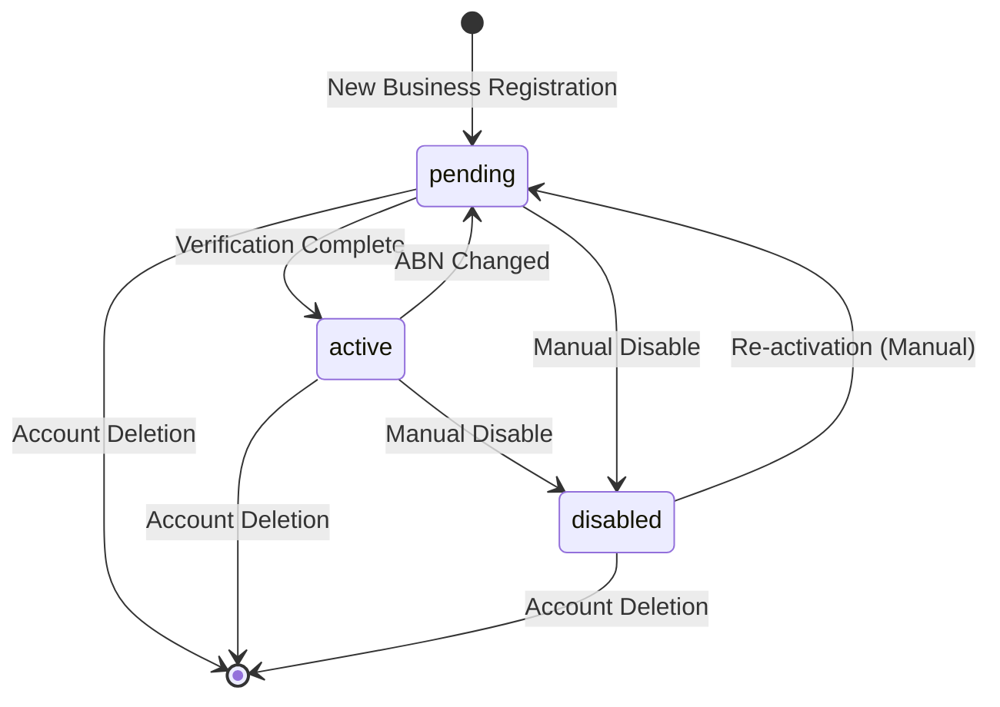
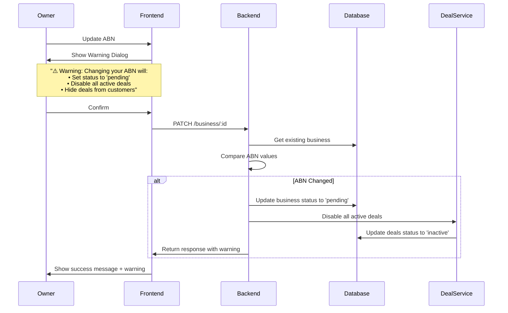
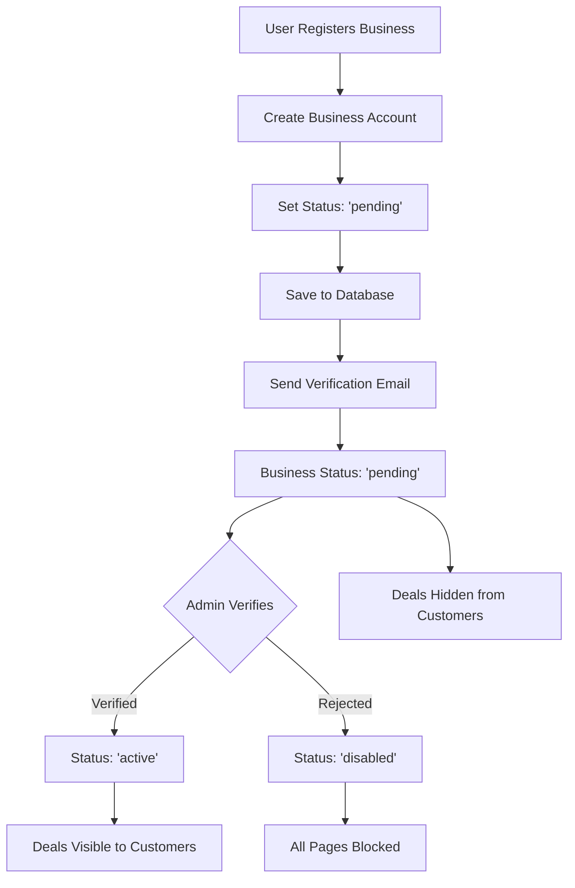

# Business Status Flows

## Business Status System

Businesses have three possible statuses:
- **`active`**: Business is verified and fully operational. Deals are visible to customers.
- **`pending`**: Business is awaiting verification. Deals are hidden from customers.
- **`disabled`**: Business has been disabled. All business pages are blocked from access.

## Status Transitions

## ABN Change Flow

When a business owner updates their ABN:

## Status-Based Access Control

### Pending Status
- **Access**: All business pages accessible
- **Deals**: Hidden from customers (not displayed in customer-facing views)
- **Message**: "Verification in Progress" alert shown to business owner
- **Features**: Business can still manage services, users, etc.

### Disabled Status
- **Access**: All business pages blocked (dashboard, management, user management)
- **Message**: "Business Disabled" page shown instead of business content
- **Features**: All business functionality unavailable until reactivated

### Active Status
- **Access**: Full access to all features
- **Deals**: Visible to customers
- **Features**: All business functionality available

## Registration Flow

## Seed Data

The seed file creates three businesses with different statuses:
1. **Active Business**: `status: 'active'` - Full functionality
2. **Pending Business**: `status: 'pending'` - Awaiting verification
3. **Disabled Business**: `status: 'disabled'` - Blocked access

