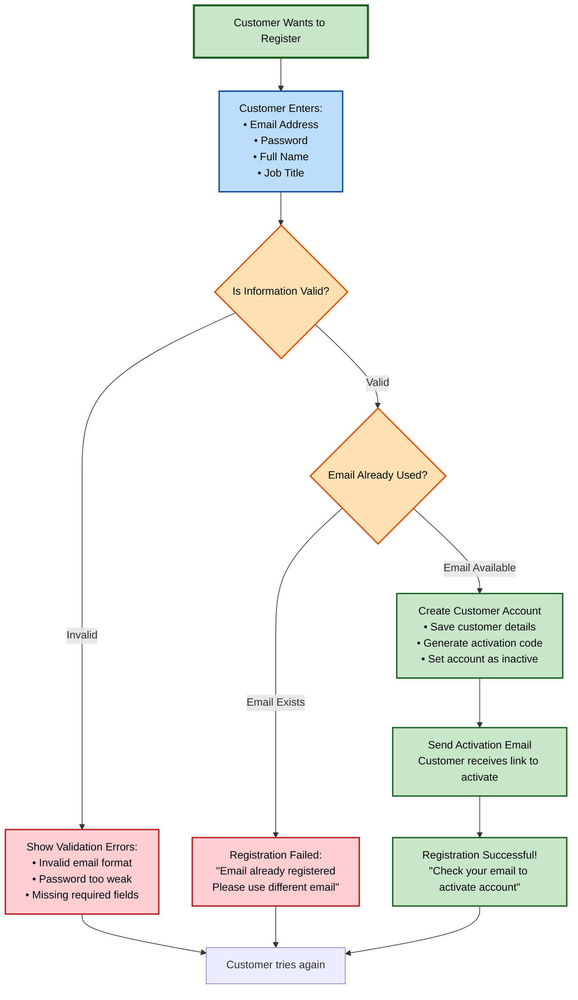

## Customer Registration Process

```mermaid
flowchart TD
    Start[Customer Wants to Register] --> Input[Customer Enters:<br/>• Email Address<br/>• Password<br/>• Full Name<br/>• Job Title]

    Input --> ValidateInput{Is Information Valid?}

    ValidateInput -->|Invalid| ValidationFail[Show Validation Errors:<br/>• Invalid email format<br/>• Password too weak<br/>• Missing required fields]

    ValidateInput -->|Valid| CheckEmail{Email Already Used?}

    CheckEmail -->|Email Exists| EmailExists[Registration Failed:<br/>&quot;Email already registered<br/>Please use different email&quot;]

    CheckEmail -->|Email Available| CreateAccount[Create Customer Account<br/>• Save customer details<br/>• Generate activation code<br/>• Set account as inactive]

    CreateAccount --> SendEmail[Send Activation Email<br/>Customer receives link to activate]

    SendEmail --> Success[Registration Successful!<br/>&quot;Check your email to activate account&quot;]

    ValidationFail --> End[Customer tries again]
    EmailExists --> End
    Success --> End

    %% Styling
    classDef startClass fill:#c8e6c9,stroke:#1b5e20,stroke-width:3px,color:#000000
    classDef errorClass fill:#ffcdd2,stroke:#b71c1c,stroke-width:2px,color:#000000
    classDef successClass fill:#c8e6c9,stroke:#1b5e20,stroke-width:2px,color:#000000
    classDef processClass fill:#bbdefb,stroke:#0d47a1,stroke-width:2px,color:#000000
    classDef decisionClass fill:#ffe0b2,stroke:#e65100,stroke-width:2px,color:#000000

    class Start startClass
    class ValidationFail,EmailExists errorClass
    class CreateAccount,SendEmail,Success successClass
    class Input processClass
    class ValidateInput,CheckEmail decisionClass
```
