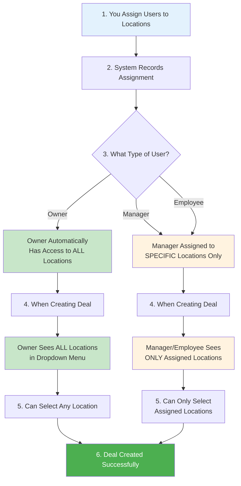

# Business User Permissions Guide

This guide explains what each type of user (Owner, Manager, Employee) can see and do in your business management system.

## Quick Summary: Who Can Do What?

| User Type | What They Can Do |
|-----------|------------------|
| **Business Owner** | Can do everything - full access to all locations, all deals, all customers, all users |
| **Manager** | Can manage their assigned locations only - create deals, view customers, manage team members at their locations |
| **Employee** | Can create deals at their assigned locations - but can only edit or delete deals they created themselves |

---

## Detailed Permissions by User Type

### 🟢 Business Owner (You - The Person Paying for This System)

**As a Business Owner, you have full control:**

#### Deal Management
- ✅ **View all deals** across your entire business
- ✅ **Create deals** for any location in your company
- ✅ **Select any location(s)** when creating a deal - you see all locations
- ✅ **Edit any deal** in your business
- ✅ **Delete any deal** in your business
- ✅ **See all locations** in the location dropdown when creating deals

#### User Management
- ✅ **View all team members** in your company
- ✅ **Add new users** (Managers and Employees)
- ✅ **Edit any user's** information and assign them to locations
- ✅ **Remove users** from your company
- ✅ **Assign users to specific locations** (this controls which locations they can manage)

#### Customer Management
- ✅ **View all customers** who have interacted with your business
- ✅ **Add customers** to your company
- ✅ **Remove customers** from your company

#### Service Management
- ✅ **View all services** your business offers
- ✅ **Create new services**
- ✅ **Edit any service**
- ✅ **Delete services**

#### Location Management (Operating Sites)
- ✅ **View all business locations**
- ✅ **Create new locations**
- ✅ **Edit any location**
- ✅ **Delete locations**
- ✅ **Assign team members to locations**

---

### 🔵 Manager

**Managers can manage specific locations they are assigned to:**

#### Deal Management
- ✅ **View deals** only at locations they are assigned to
- ✅ **Create deals** but only for locations they are assigned to
- ✅ **See only their assigned locations** in the location dropdown (they cannot see or select other locations)
- ✅ **Edit deals** at their assigned locations (any deal, not just ones they created)
- ✅ **Delete deals** at their assigned locations

**Important:** Before a Manager can create deals, you (the Owner) must first assign them to specific locations. Once assigned, they will only see those locations when creating deals.

#### User Management
- ✅ **View team members** who work at the same locations they manage
- ✅ **Add new Employees** (but cannot create Managers or Owners)
- ✅ **Edit employees** at their locations
- ✅ **Remove employees** from their locations

#### Customer Management
- ✅ **View all customers** who have interacted with your business
- ✅ **Add customers** to your company
- ✅ **Remove customers** from your company

#### Service Management
- ✅ **View all services** your business offers
- ✅ **Create new services**
- ✅ **Edit any service**
- ✅ **Delete services**

#### Location Management
- ❌ **Cannot create or delete locations** (only Owner can do this)
- ✅ **Can view locations** they are assigned to

---

### 🟠 Employee

**Employees have the most limited access - they can work with deals at their assigned locations:**

#### Deal Management
- ✅ **View deals** only at locations they are assigned to
- ✅ **Create deals** but only for locations they are assigned to
- ✅ **See only their assigned locations** in the location dropdown (they cannot see or select other locations)
- ✅ **Edit deals** they created themselves (cannot edit deals created by others)
- ✅ **Delete deals** they created themselves (cannot delete deals created by others)

**Important:** Before an Employee can create deals, you (the Owner) or a Manager must first assign them to specific locations. Once assigned, they will only see those locations when creating deals.

#### User Management
- ❌ **Cannot view or manage other users**

#### Customer Management
- ❌ **Cannot view or manage customers** (only Owners and Managers can)

#### Service Management
- ✅ **View all services** your business offers
- ❌ **Cannot create, edit, or delete services** (only Owners and Managers can)

#### Location Management
- ❌ **Cannot view, create, or manage locations**

---

## Step-by-Step: How Site Assignment Works

---

## Visual Example: What Users See When Creating a Deal

### Business Owner Sees:
**Location Dropdown Menu shows:**
- Downtown Store
- Uptown Store
- Mall Location
- Airport Branch
- City Center
- All other locations in your business

**Owner can select any or all locations**

---

### Manager Sees - If assigned to Downtown, Uptown, and Mall:
**Location Dropdown Menu shows ONLY:**
- Downtown Store
- Uptown Store
- Mall Location

**Manager only sees locations they are assigned to. Other locations such as Airport and City Center are not shown.**

---

### Employee Sees - If assigned to Downtown only:
**Location Dropdown Menu shows ONLY:**
- Downtown Store

**Employee only sees locations they are assigned to. Other locations are not shown.**

---

## Common Questions

### Q: How do I assign a Manager or Employee to specific locations?

**A:** 
1. Go to **User Management** section
2. Find the user you want to assign
3. Click **Edit** on that user
4. In the **Store Access** section, check the boxes for the locations you want them to manage
5. Click **Save**

### Q: Can a Manager create deals for locations they're not assigned to?

**A:** No. Managers can only see and select locations they have been assigned to. This is by design to ensure they only manage locations you've given them permission for.

### Q: Can an Employee edit a deal created by someone else?

**A:** No. Employees can only edit or delete deals they created themselves. This prevents mistakes and ensures accountability.

### Q: What happens if I don't assign an Employee to any locations?

**A:** They won't be able to create any deals. They need at least one location assignment before they can work with deals. The system will show them a message: "You have no access to any store, please contact your Admin"

### Q: Can I change a user's assigned locations later?

**A:** Yes! Simply go to User Management, edit that user, and update their Store Access. The changes take effect immediately.

---

## Permission Comparison Table

| Feature | Owner | Manager | Employee |
|---------|-------|---------|----------|
| **View All Deals** | ✅ | ❌ (Only assigned locations) | ❌ (Only assigned locations) |
| **Create Deals** | ✅ (Any location) | ✅ (Assigned locations only) | ✅ (Assigned locations only) |
| **Edit Deals** | ✅ (All deals) | ✅ (Deals at assigned locations) | ✅ (Only own deals) |
| **Delete Deals** | ✅ (All deals) | ✅ (Deals at assigned locations) | ✅ (Only own deals) |
| **View/Manage Users** | ✅ | ✅ (At assigned locations) | ❌ |
| **View/Manage Customers** | ✅ | ✅ | ❌ |
| **View Services** | ✅ | ✅ | ✅ |
| **Create/Edit Services** | ✅ | ✅ | ❌ |
| **View/Manage Locations** | ✅ | ❌ (View only) | ❌ |

---

## Important Notes for Business Owners

1. **Assignment Comes First**: Before Managers or Employees can create deals, you must assign them to at least one location. This is done in the User Management section.

2. **Location Visibility**: When creating deals, users only see locations they're assigned to. This prevents them from accidentally creating deals for locations they don't manage.

3. **Deal Ownership**: Employees can only modify deals they created. This helps maintain accountability and prevents unauthorized changes.

4. **Full Control**: As the Owner, you always have access to everything. You can override any restriction by directly accessing any location, deal, or user.

5. **Security**: The system automatically enforces these rules. Users cannot see or access anything they're not authorized for.
