# Deal Management Permissions and Workflows

## Business User Roles and Deal Management Permissions

```mermaid
flowchart TD
    Start[User Accesses Deal Management] --> CheckRole{What is User Role?}
    
    %% Owner Path
    CheckRole -->|Owner| OwnerPath[Business Owner]
    OwnerPath --> OwnerAccess[Full Company Access]
    OwnerAccess --> OwnerSites[Can View ALL Operating Sites]
    OwnerSites --> OwnerCreate[Create Deal:<br/>• Select ANY operating site<br/>• Multi-select available<br/>• All sites visible]
    OwnerCreate --> OwnerEdit[Edit/Delete:<br/>• Can edit ALL deals<br/>• Can delete ALL deals<br/>• Full control]
    OwnerEdit --> OwnerView[View:<br/>• All company deals<br/>• All operating sites<br/>• Complete visibility]
    
    %% Manager Path
    CheckRole -->|Manager| ManagerPath[Manager]
    ManagerPath --> ManagerAccess[Limited Site Access]
    ManagerAccess --> ManagerSites[Can View ONLY Assigned Sites]
    ManagerSites --> ManagerCreate[Create Deal:<br/>• Select ONLY assigned sites<br/>• Multi-select available<br/>• Filtered site list]
    ManagerCreate --> ManagerEdit[Edit/Delete:<br/>• Can edit deals at assigned sites<br/>• Can delete deals at assigned sites<br/>• Site-restricted access]
    ManagerEdit --> ManagerView[View:<br/>• Deals at assigned sites only<br/>• Assigned operating sites only<br/>• Filtered visibility]
    
    %% Employee Path
    CheckRole -->|Employee| EmployeePath[Employee]
    EmployeePath --> EmployeeAccess[Limited Site Access]
    EmployeeAccess --> EmployeeSites[Can View ONLY Assigned Sites]
    EmployeeSites --> EmployeeCreate[Create Deal:<br/>• Select ONLY assigned sites<br/>• Multi-select available<br/>• Filtered site list]
    EmployeeCreate --> EmployeeEdit[Edit/Delete:<br/>• Can ONLY edit own deals<br/>• Can ONLY delete own deals<br/>• Creator-restricted access]
    EmployeeEdit --> EmployeeView[View:<br/>• Deals at assigned sites only<br/>• Assigned operating sites only<br/>• Filtered visibility]
    
    %% Common Endpoint
    OwnerView --> Success[Deal Management Complete]
    ManagerView --> Success
    EmployeeView --> Success
    
    %% Styling
    classDef ownerClass fill:#4caf50,stroke:#1b5e20,stroke-width:3px,color:#ffffff
    classDef managerClass fill:#2196f3,stroke:#0d47a1,stroke-width:2px,color:#ffffff
    classDef employeeClass fill:#ff9800,stroke:#e65100,stroke-width:2px,color:#ffffff
    classDef decisionClass fill:#ffe0b2,stroke:#e65100,stroke-width:2px,color:#000000
    classDef processClass fill:#e1f5fe,stroke:#01579b,stroke-width:2px,color:#000000
    classDef successClass fill:#c8e6c9,stroke:#1b5e20,stroke-width:2px,color:#000000
    
    class OwnerPath,OwnerAccess,OwnerSites,OwnerCreate,OwnerEdit,OwnerView ownerClass
    class ManagerPath,ManagerAccess,ManagerSites,ManagerCreate,ManagerEdit,ManagerView managerClass
    class EmployeePath,EmployeeAccess,EmployeeSites,EmployeeCreate,EmployeeEdit,EmployeeView employeeClass
    class CheckRole decisionClass
    class Start processClass
    class Success successClass
```



## Site Assignment → Deal Creation Relationship Flow

```mermaid
flowchart TB
    subgraph Setup["🔧 User Setup & Site Assignment"]
        A1[Owner/Manager assigns user to Operating Sites] --> A2[User's Site Assignment Stored]
        A2 --> A3{User Role?}
        A3 -->|Owner| A4[Assigned to ALL Sites]
        A3 -->|Manager/Employee| A5[Assigned to SPECIFIC Sites]
    end
    
    subgraph DealCreation["📝 Creating a Deal"]
        B1[User Clicks 'Add Deal'] --> B2[UI Requests Available Sites]
        B2 --> B3{Backend Checks User Role}
        B3 -->|Owner| B4[Returns ALL Company Sites]
        B3 -->|Manager/Employee| B5[Returns ONLY Assigned Sites]
        B4 --> B6[Site Multi-Select Dropdown]
        B5 --> B6
        B6 --> B7[User Sees Filtered Site List]
        B7 --> B8{User Role?}
        B8 -->|Owner| B9[Can Select ANY Site]
        B8 -->|Manager/Employee| B10[Can ONLY Select Assigned Sites]
        B9 --> B11[User Selects Site(s)]
        B10 --> B11
        B11 --> B12[Submit Deal]
        B12 --> B13{Backend Validates Site Access}
        B13 -->|Valid| B14[Deal Created Successfully]
        B13 -->|Invalid| B15[Error: Access Denied]
    end
    
    A4 --> B3
    A5 --> B3
    
    B14 --> End[✅ Deal Created]
    B15 --> Error[❌ Deal Creation Failed]
    
    %% Styling
    classDef setupClass fill:#e3f2fd,stroke:#1976d2,stroke-width:2px
    classDef dealClass fill:#f3e5f5,stroke:#7b1fa2,stroke-width:2px
    classDef ownerFlow fill:#c8e6c9,stroke:#388e3c,stroke-width:2px
    classDef restrictedFlow fill:#fff3e0,stroke:#f57c00,stroke-width:2px
    classDef successClass fill:#c8e6c9,stroke:#2e7d32,stroke-width:2px
    classDef errorClass fill:#ffcdd2,stroke:#c62828,stroke-width:2px
    
    class A1,A2,A3,A4,A5 setupClass
    class B1,B2,B3,B4,B5,B6,B7,B8,B9,B10,B11,B12,B13 dealClass
    class A4,B4,B9 ownerFlow
    class A5,B5,B10 restrictedFlow
    class B14,End successClass
    class B15,Error errorClass
```

## Deal Creation Workflow with Site Selection Details


## Site Selection Rules by Role

```mermaid
flowchart LR
    subgraph Owner["🟢 Business Owner"]
        O1[View All Sites]
        O2[Select All Sites]
        O3[Create Deals for Any Site]
        O1 --> O2 --> O3
    end
    
    subgraph Manager["🔵 Manager"]
        M1[View Assigned Sites Only]
        M2[Select Assigned Sites Only]
        M3[Create Deals for Assigned Sites]
        M1 --> M2 --> M3
    end
    
    subgraph Employee["🟠 Employee"]
        E1[View Assigned Sites Only]
        E2[Select Assigned Sites Only]
        E3[Create Deals for Assigned Sites]
        E1 --> E2 --> E3
    end
    
    %% Styling
    classDef ownerBox fill:#e8f5e9,stroke:#4caf50,stroke-width:3px
    classDef managerBox fill:#e3f2fd,stroke:#2196f3,stroke-width:2px
    classDef employeeBox fill:#fff3e0,stroke:#ff9800,stroke-width:2px
    
    class Owner ownerBox
    class Manager managerBox
    class Employee employeeBox
```



## UI/UX Flow: Site Selection in Deal Creation

```mermaid
flowchart TD
    Start[User Opens Deal Creation Form] --> LoadSites[UI Loads Available Sites]
    LoadSites --> CheckRole{Check User Role}
    
    CheckRole -->|Owner| OwnerUI[Multi-Select Dropdown:<br/>┌─────────────────────────┐<br/>│ Operating Sites         ▼│<br/>├─────────────────────────┤<br/>│ ☑ Site A (Downtown)    │<br/>│ ☑ Site B (Uptown)      │<br/>│ ☑ Site C (Midtown)     │<br/>│ ☑ Site D (Airport)     │<br/>│ ☑ Site E (Mall)        │<br/>│ ☑ ... (ALL sites)      │<br/>└─────────────────────────┘<br/>Status: All sites available]
    
    CheckRole -->|Manager| ManagerUI[Multi-Select Dropdown:<br/>┌─────────────────────────┐<br/>│ Operating Sites         ▼│<br/>├─────────────────────────┤<br/>│ ☑ Site A (Downtown)    │<br/>│ ☑ Site B (Uptown)      │<br/>│ ☑ Site C (Midtown)     │<br/>└─────────────────────────┘<br/>Status: Only assigned sites shown<br/>Sites D, E, etc. NOT visible]
    
    CheckRole -->|Employee| EmployeeUI[Multi-Select Dropdown:<br/>┌─────────────────────────┐<br/>│ Operating Sites         ▼│<br/>├─────────────────────────┤<br/>│ ☑ Site A (Downtown)    │<br/>│ ☑ Site C (Midtown)     │<br/>└─────────────────────────┘<br/>Status: Only assigned sites shown<br/>Sites B, D, E, etc. NOT visible]
    
    OwnerUI --> SelectSites1[User can select ANY combination]
    ManagerUI --> SelectSites2[User can ONLY select from shown sites]
    EmployeeUI --> SelectSites2
    
    SelectSites1 --> Submit1[Submit Deal]
    SelectSites2 --> Submit2[Submit Deal]
    
    Submit1 --> Validate1{Backend Validates}
    Submit2 --> Validate2{Backend Validates}
    
    Validate1 -->|Owner: Always Valid| Success1[✅ Deal Created]
    Validate2 -->|All Selected Sites are Assigned| Success2[✅ Deal Created]
    Validate2 -->|One or More Sites Not Assigned| Error[❌ Error: Access Denied<br/>Cannot create deal for<br/>sites you're not assigned to]
    
    %% Styling
    classDef ownerUI fill:#c8e6c9,stroke:#2e7d32,stroke-width:2px
    classDef restrictedUI fill:#fff3e0,stroke:#f57c00,stroke-width:2px
    classDef successClass fill:#4caf50,stroke:#1b5e20,stroke-width:2px,color:#fff
    classDef errorClass fill:#f44336,stroke:#c62828,stroke-width:2px,color:#fff
    classDef decisionClass fill:#ffe0b2,stroke:#e65100,stroke-width:2px
    
    class OwnerUI ownerUI
    class ManagerUI,EmployeeUI restrictedUI
    class Success1,Success2 successClass
    class Error errorClass
    class CheckRole,Validate1,Validate2 decisionClass
```

## Permission Summary Table

| Role | View Sites | Select Sites | Create Deals | Edit Deals | Delete Deals |
|------|------------|--------------|--------------|------------|--------------|
| **Owner** | All company sites | All company sites | For any site | All deals | All deals |
| **Manager** | Only assigned sites | Only assigned sites | For assigned sites | Deals at assigned sites | Deals at assigned sites |
| **Employee** | Only assigned sites | Only assigned sites | For assigned sites | Only own deals | Only own deals |

## Key Rules

1. **Business Owner**:
   - Has full access to all operating sites in the company
   - Can create deals selecting any combination of sites
   - Can edit and delete any deal in the company
   - No restrictions on site selection
   - **UI displays ALL sites** in the multi-select dropdown

2. **Manager**:
   - Limited to operating sites where they are assigned as a member
   - Can create deals but only for sites they have access to
   - **UI ONLY displays assigned sites** in the multi-select dropdown
   - Sites they're not assigned to are **NOT visible** in the dropdown
   - Can edit/delete deals at their assigned sites
   - Cannot access or create deals for sites they're not assigned to
   - **Site assignment must be done FIRST** by Owner/Manager before creating deals

3. **Employee**:
   - Limited to operating sites where they are assigned as a member
   - Can create deals but only for sites they have access to
   - **UI ONLY displays assigned sites** in the multi-select dropdown
   - Sites they're not assigned to are **NOT visible** in the dropdown
   - Can ONLY edit/delete deals they created themselves
   - Cannot modify deals created by others, even at their sites
   - **Site assignment must be done FIRST** by Owner/Manager before creating deals

## Important UI Implementation Note

**The site selection dropdown MUST filter sites based on user assignment:**
- For **Owners**: Show all company sites
- For **Managers/Employees**: Show ONLY sites where the user is in the `members` array of the Operating Site
- This filtering happens **BEFORE** the dropdown is displayed to the user
- Users should **never see sites they cannot select** - this prevents confusion and errors
