# Deal Management Permissions and Workflows

## Business User Roles and Deal Management Permissions

```mermaid
flowchart TD
    Start[User Accesses Deal Management] --> CheckRole{What is User Role?}
    
    %% Owner Path
    CheckRole -->|Owner| OwnerPath[Business Owner]
    OwnerPath --> OwnerAccess[Full Company Access]
    OwnerAccess --> OwnerSites[Can View ALL Operating Sites]
    OwnerSites --> OwnerCreate[Create Deal:<br/>• Select ANY operating site<br/>• Multi-select available<br/>• All sites visible]
    OwnerCreate --> OwnerEdit[Edit/Delete:<br/>• Can edit ALL deals<br/>• Can delete ALL deals<br/>• Full control]
    OwnerEdit --> OwnerView[View:<br/>• All company deals<br/>• All operating sites<br/>• Complete visibility]
    
    %% Manager Path
    CheckRole -->|Manager| ManagerPath[Manager]
    ManagerPath --> ManagerAccess[Limited Site Access]
    ManagerAccess --> ManagerSites[Can View ONLY Assigned Sites]
    ManagerSites --> ManagerCreate[Create Deal:<br/>• Select ONLY assigned sites<br/>• Multi-select available<br/>• Filtered site list]
    ManagerCreate --> ManagerEdit[Edit/Delete:<br/>• Can edit deals at assigned sites<br/>• Can delete deals at assigned sites<br/>• Site-restricted access]
    ManagerEdit --> ManagerView[View:<br/>• Deals at assigned sites only<br/>• Assigned operating sites only<br/>• Filtered visibility]
    
    %% Employee Path
    CheckRole -->|Employee| EmployeePath[Employee]
    EmployeePath --> EmployeeAccess[Limited Site Access]
    EmployeeAccess --> EmployeeSites[Can View ONLY Assigned Sites]
    EmployeeSites --> EmployeeCreate[Create Deal:<br/>• Select ONLY assigned sites<br/>• Multi-select available<br/>• Filtered site list]
    EmployeeCreate --> EmployeeEdit[Edit/Delete:<br/>• Can ONLY edit own deals<br/>• Can ONLY delete own deals<br/>• Creator-restricted access]
    EmployeeEdit --> EmployeeView[View:<br/>• Deals at assigned sites only<br/>• Assigned operating sites only<br/>• Filtered visibility]
    
    %% Common Endpoint
    OwnerView --> Success[Deal Management Complete]
    ManagerView --> Success
    EmployeeView --> Success
    
    %% Styling
    classDef ownerClass fill:#4caf50,stroke:#1b5e20,stroke-width:3px,color:#ffffff
    classDef managerClass fill:#2196f3,stroke:#0d47a1,stroke-width:2px,color:#ffffff
    classDef employeeClass fill:#ff9800,stroke:#e65100,stroke-width:2px,color:#ffffff
    classDef decisionClass fill:#ffe0b2,stroke:#e65100,stroke-width:2px,color:#000000
    classDef processClass fill:#e1f5fe,stroke:#01579b,stroke-width:2px,color:#000000
    classDef successClass fill:#c8e6c9,stroke:#1b5e20,stroke-width:2px,color:#000000
    
    class OwnerPath,OwnerAccess,OwnerSites,OwnerCreate,OwnerEdit,OwnerView ownerClass
    class ManagerPath,ManagerAccess,ManagerSites,ManagerCreate,ManagerEdit,ManagerView managerClass
    class EmployeePath,EmployeeAccess,EmployeeSites,EmployeeCreate,EmployeeEdit,EmployeeView employeeClass
    class CheckRole decisionClass
    class Start processClass
    class Success successClass
```

## Site Selection Rules by Role

```mermaid
flowchart LR
    subgraph Owner["🟢 Business Owner"]
        O1[View All Sites]
        O2[Select All Sites]
        O3[Create Deals for Any Site]
        O1 --> O2 --> O3
    end
    
    subgraph Manager["🔵 Manager"]
        M1[View Assigned Sites Only]
        M2[Select Assigned Sites Only]
        M3[Create Deals for Assigned Sites]
        M1 --> M2 --> M3
    end
    
    subgraph Employee["🟠 Employee"]
        E1[View Assigned Sites Only]
        E2[Select Assigned Sites Only]
        E3[Create Deals for Assigned Sites]
        E1 --> E2 --> E3
    end
    
    %% Styling
    classDef ownerBox fill:#e8f5e9,stroke:#4caf50,stroke-width:3px
    classDef managerBox fill:#e3f2fd,stroke:#2196f3,stroke-width:2px
    classDef employeeBox fill:#fff3e0,stroke:#ff9800,stroke-width:2px
    
    class Owner ownerBox
    class Manager managerBox
    class Employee employeeBox
```

## Deal Creation Workflow

## Permission Summary Table

| Role | View Sites | Select Sites | Create Deals | Edit Deals | Delete Deals |
|------|------------|--------------|--------------|------------|--------------|
| **Owner** | All company sites | All company sites | For any site | All deals | All deals |
| **Manager** | Only assigned sites | Only assigned sites | For assigned sites | Deals at assigned sites | Deals at assigned sites |
| **Employee** | Only assigned sites | Only assigned sites | For assigned sites | Only own deals | Only own deals |

## Key Rules

1. **Business Owner**:
   - Has full access to all operating sites in the company
   - Can create deals selecting any combination of sites
   - Can edit and delete any deal in the company
   - No restrictions on site selection

2. **Manager**:
   - Limited to operating sites where they are assigned as a member
   - Can create deals but only for sites they have access to
   - Site dropdown is filtered to show only accessible sites
   - Can edit/delete deals at their assigned sites
   - Cannot access or create deals for sites they're not assigned to

3. **Employee**:
   - Limited to operating sites where they are assigned as a member
   - Can create deals but only for sites they have access to
   - Site dropdown is filtered to show only accessible sites
   - Can ONLY edit/delete deals they created themselves
   - Cannot modify deals created by others, even at their sites
