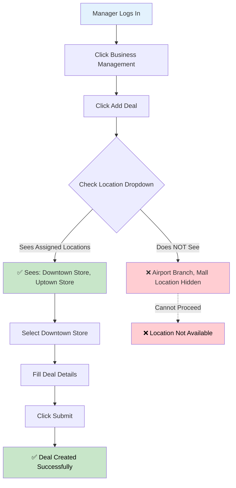
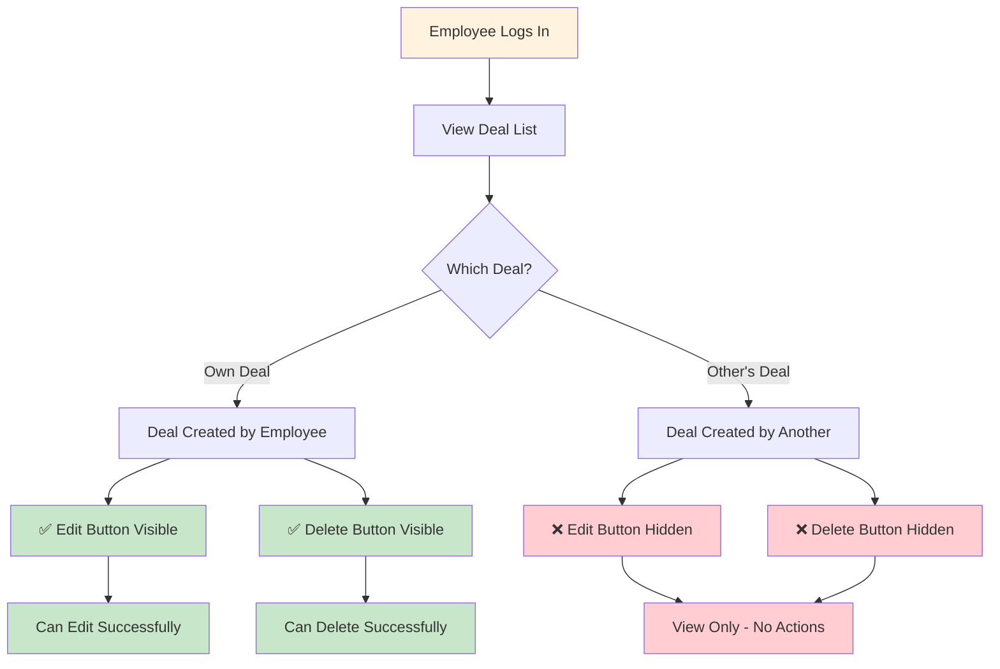
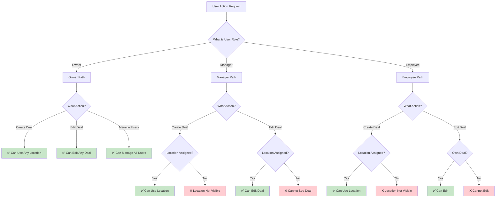

# Test Scenarios - Visual Format

Alternative visual formats for demonstrating system permissions to business owners.

---

## Format 1: User Journey Flowcharts

### Manager Creating a Deal - Flowchart



---

### Employee Deal Management - Flowchart



---

### Permission Decision Tree



---

## Format 2: Quick Reference Matrix

### Action vs Role Matrix

| Action | Owner | Manager | Employee |
|--------|:-----:|:-------:|:--------:|
| **Create Deal - Any Location** | ✅ | ❌ | ❌ |
| **Create Deal - Assigned Location** | ✅ | ✅ | ✅ |
| **Edit Own Deal** | ✅ | ✅ | ✅ |
| **Edit Other's Deal (Same Location)** | ✅ | ✅ | ❌ |
| **Edit Deal (Different Location)** | ✅ | ❌ | ❌ |
| **Delete Own Deal** | ✅ | ✅ | ✅ |
| **Delete Other's Deal** | ✅ | ✅ | ❌ |
| **View All Deals** | ✅ | ❌ (Only assigned) | ❌ (Only assigned) |
| **Manage Users** | ✅ | ✅ (Assigned locations) | ❌ |
| **View Customers** | ✅ | ✅ | ❌ |
| **Manage Services** | ✅ | ✅ | ❌ |
| **Manage Locations** | ✅ | ❌ | ❌ |

---

## Format 3: Scenario Cards (One-Page Format)

### Scenario Card: Manager Creates Deal
```
┌─────────────────────────────────────────────┐
│ SCENARIO: Manager Creates Deal              │
│ User: Manager                               │
│ Goal: Create deal at assigned location      │
├─────────────────────────────────────────────┤
│ STEPS:                                      │
│ 1. Login → Business Management              │
│ 2. Click "Add Deal"                         │
│ 3. Location dropdown → Shows ONLY assigned  │
│ 4. Select "Downtown Store"                  │
│ 5. Fill details → Submit                    │
├─────────────────────────────────────────────┤
│ EXPECTED:                                   │
│ ✅ Sees assigned locations only             │
│ ✅ Cannot see unassigned locations          │
│ ✅ Deal created successfully                │
└─────────────────────────────────────────────┘
```

### Scenario Card: Employee Edits Deal
```
┌─────────────────────────────────────────────┐
│ SCENARIO: Employee Edits Deal               │
│ User: Employee                              │
│ Goal: Edit own deal (allowed)               │
├─────────────────────────────────────────────┤
│ STEPS:                                      │
│ 1. Login → View Deal List                   │
│ 2. Find own deal                            │
│ 3. Click "Edit" → ✅ Button visible         │
│ 4. Modify details → Save                    │
├─────────────────────────────────────────────┤
│ EXPECTED:                                   │
│ ✅ Can edit own deals                       │
│ ❌ Cannot edit other employees' deals       │
└─────────────────────────────────────────────┘
```

---

## Format 4: Side-by-Side Comparison

### Creating a Deal - All Roles Compared

| Step | Owner | Manager | Employee |
|------|-------|---------|----------|
| **1. Login** | ✅ | ✅ | ✅ |
| **2. Navigate to Deal Management** | ✅ | ✅ | ✅ |
| **3. Click "Add Deal"** | ✅ | ✅ | ✅ |
| **4. Location Dropdown Shows** | All locations | Only assigned | Only assigned |
| **5. Can Select** | Any location | Assigned only | Assigned only |
| **6. Submit Deal** | ✅ Success | ✅ Success | ✅ Success |

### Editing a Deal - All Roles Compared

| Deal Type | Owner | Manager | Employee |
|-----------|-------|---------|----------|
| **Own Deal** | ✅ Edit | ✅ Edit | ✅ Edit |
| **Other's Deal (Same Location)** | ✅ Edit | ✅ Edit | ❌ Cannot |
| **Other's Deal (Different Location)** | ✅ Edit | ❌ Cannot | ❌ Cannot |

---

## Format 5: Before/After Scenarios

### Before Assignment vs After Assignment

**Manager - Before Location Assignment:**
- ❌ Cannot create deals
- ❌ No locations visible in dropdown
- ❌ See message: "You have no access to any store"

**Manager - After Owner Assigns to Downtown Store:**
- ✅ Can create deals
- ✅ "Downtown Store" appears in dropdown
- ✅ Can select and create deals for Downtown Store only
- ❌ Still cannot see "Airport Branch" or other locations

---

## Format 6: User Story Format

### User Story 1: Manager
**As a** Manager  
**I want to** create deals for my assigned locations  
**So that** I can manage promotions for stores I'm responsible for  

**Acceptance Criteria:**
- ✅ I can see only locations I'm assigned to in the dropdown
- ✅ I can create deals for any of my assigned locations
- ✅ I cannot see or select locations I'm not assigned to
- ✅ Deals I create are visible to other managers at the same location

### User Story 2: Employee
**As an** Employee  
**I want to** create and edit my own deals  
**So that** I can manage deals I create without affecting others' work  

**Acceptance Criteria:**
- ✅ I can create deals for locations I'm assigned to
- ✅ I can edit deals I created myself
- ✅ I cannot edit deals created by other employees
- ✅ I can view deals created by others at my location (read-only)

---

## Format 7: Step-by-Step with Screenshots Placeholders

### Scenario: Manager Creates Deal
1. **Screen 1:** Login page
   - Manager enters credentials
   - Clicks "Login"

2. **Screen 2:** Business Management page
   - [Screenshot placeholder] Shows Deal Management section
   - Click "Add Deal" button

3. **Screen 3:** Deal Creation Form - Location Dropdown
   - [Screenshot placeholder] Dropdown shows: "Downtown Store", "Uptown Store"
   - Notice: "Airport Branch" is NOT in the list

4. **Screen 4:** Deal Created Successfully
   - [Screenshot placeholder] Success message
   - Deal appears in list

---

## Recommended Format for Business Owners

**For Live Demo:**
- Use **Format 1 (Flowcharts)** for visual explanation
- Use **Format 2 (Quick Reference Matrix)** for quick lookups
- Use **Format 4 (Side-by-Side Comparison)** to show differences

**For Documentation:**
- Use **Format 3 (Scenario Cards)** - easy to print/share
- Use **Format 6 (User Story Format)** - business-friendly language

**For Testing:**
- Use detailed step-by-step from main test-scenarios.md
- Use **Format 5 (Before/After)** to show setup impact

---

## Quick Demo Script (Using Visual Formats)

1. **Start with Format 2 (Matrix)** - "Here's what each role can do"
2. **Show Format 1 (Flowchart)** - "Let me walk through how this works"
3. **Demo live** - Follow the flowchart steps
4. **Show Format 4 (Side-by-Side)** - "Notice the differences"
5. **Use Format 5 (Before/After)** - "Here's what happens after assignment"
